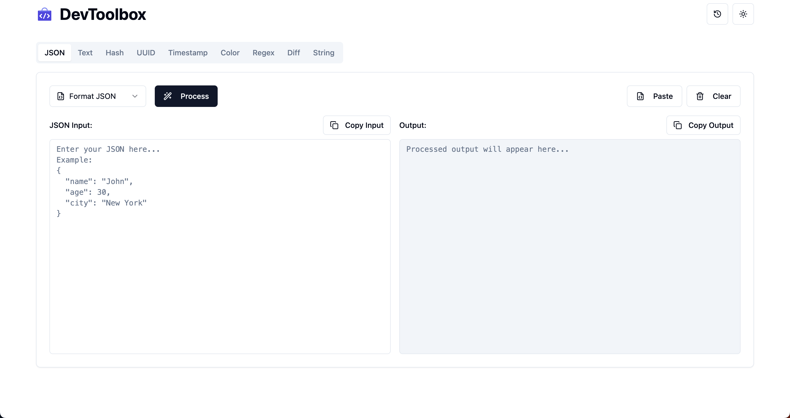

# DevToolbox

A powerful collection of developer tools for everyday tasks. Built with modern web technologies to help developers streamline their workflow.

## 🚀 Screenshot



*JSON Formatter tool interface showing the input and output panels with formatting capabilities*

## 🚀 Features

- **JSON Tools**
  - Format and validate JSON
  - Copy formatted output
  - Paste functionality
  - Clear workspace

- **Additional Tools**
  - Text manipulation
  - Hash generator
  - UUID generator
  - Timestamp converter
  - Color tools
  - Regex tester
  - Diff checker
  - String utilities

## 🛠️ Tech Stack

- Frontend: React with TypeScript
- Backend: Node.js with Express
- Styling: TailwindCSS
- Testing: Jest

## 🏃‍♂️ Getting Started

### Prerequisites

- Node.js (v16 or higher)
- npm or yarn

### Installation

1. Clone the repository:
```bash
git clone https://github.com/yourusername/devtoolbox.git
cd devtoolbox
```

2. Install dependencies:
```bash
# Install frontend dependencies
cd frontend
npm install

# Install backend dependencies
cd ../backend
npm install
```

3. Set up environment variables:
```bash
# Frontend
cp frontend/.env.example frontend/.env

# Backend
cp .env.prod.example .env
```

4. Start the development servers:
```bash
# Start backend
cd backend
npm run dev

# Start frontend (in a new terminal)
cd frontend
npm run dev
```

## 🐳 Docker Deployment

```bash
# Production deployment
docker-compose -f docker-compose.prod.yml up -d
```

## 📝 Contributing

1. Fork the repository
2. Create your feature branch (`git checkout -b feature/amazing-feature`)
3. Commit your changes (`git commit -m 'feat: add amazing feature'`)
4. Push to the branch (`git push origin feature/amazing-feature`)
5. Open a Pull Request

## 📜 License

This project is licensed under the MIT License - see the [LICENSE](LICENSE) file for details.

## 🤝 Support

For support, email support@devtoolbox.com or open an issue in the repository. 
